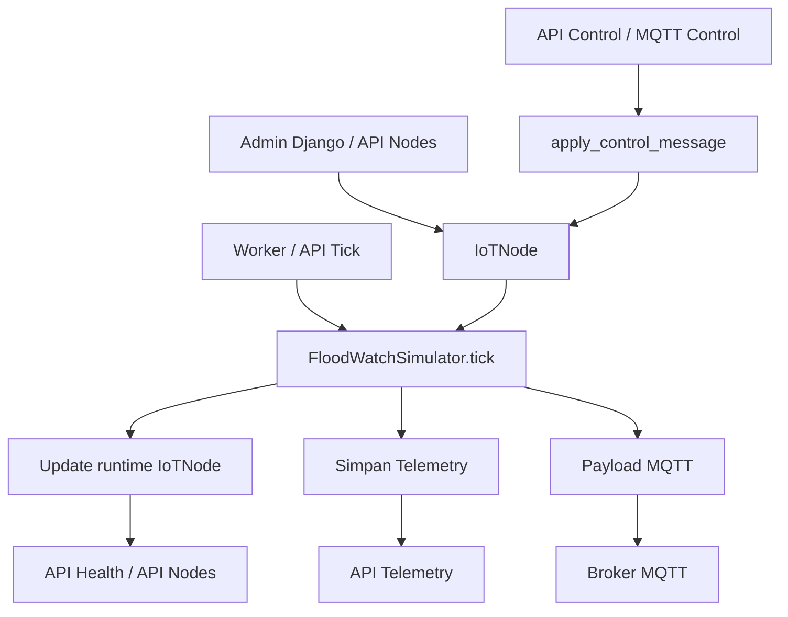

# Alur Data SimFLOODWATCHV2

## Gambaran Singkat

Sistem ini meniru perangkat FloodWatch. Sumber data bisa datang dari:

- mode `SCENARIO` yang membuat data sensor sintetis
- mode `MANUAL` yang memakai nilai input dari admin
- payload kontrol dari API atau MQTT

Semua alur akhirnya bermuara ke model `IoTNode` sebagai state aktif dan model `Telemetry` sebagai histori.

## Diagram Alur Utama

## Alur Startup

1. `manage.py` menetapkan `DJANGO_SETTINGS_MODULE`.
2. `config/settings.py` memuat `.env`, app Django, database SQLite, dan konfigurasi REST API.
3. `config/urls.py` mendaftarkan route admin, API node, API telemetry, API health, dan endpoint simulator.

## Alur Master Data Node

1. Node disimpan di tabel `devices_iotnode`.
2. Perubahan node bisa datang dari:
   - Django admin
   - API `POST/PUT/PATCH /api/nodes/`
   - command `seed_demo_nodes`
   - `apply_control_message()` untuk field kontrol tertentu
3. Sebelum tersimpan, `IoTNode.clean()` menormalkan semua nilai agar tetap aman.

## Alur Tick Simulator

1. Tick dipicu oleh:
   - `POST /api/simulator/tick/<node_id>/`
   - command `simulate_node`
   - command `run_simulator_worker`
2. `FloodWatchSimulator` memuat state runtime dari `IoTNode.runtime_state`.
3. Sistem menentukan jarak mentah:
   - dari slider admin jika mode `MANUAL`
   - dari `generate_distance_for_scenario()` jika mode `SCENARIO`
4. Nilai mentah dihaluskan dengan smoothing EMA.
5. Sistem menentukan:
   - `water_switch`
   - `status` banjir
   - target servo
   - posisi servo aktual
6. Record `IoTNode` diperbarui sebagai state aktif terbaru.
7. Record `Telemetry` dibuat sebagai histori tick.
8. Bila MQTT aktif, payload telemetry dipublish ke broker.

## Alur Kontrol Node

Ada dua jalur kontrol:

1. API `POST /api/simulator/control/`
2. pesan MQTT yang diterima `FloodWatchMQTTClient`

Keduanya berakhir di `apply_control_message()` yang dapat:

- mengganti scenario
- mengganti interval
- mengganti mode simulasi
- mengubah servo ke mode auto atau manual
- mengubah target servo
- mengubah parameter simulasi manual
- menyalakan atau mematikan simulator/MQTT
- memperbarui metadata node tertentu

## Alur Query Telemetry

1. Client memanggil `GET /api/telemetry/`.
2. `TelemetryViewSet.get_queryset()` memfilter data berdasarkan `node_id` dan `status` bila ada.
3. Serializer mengembalikan data telemetry plus `node_id` dan `node_name`.
4. Endpoint `latest` mengambil data terbaru per node atau per node tertentu.

## State yang Penting

### State permanen

Disimpan di `IoTNode`, contohnya:

- identitas node
- lokasi
- interval simulator
- threshold status
- konfigurasi servo
- mode kontrol

### State runtime

Juga disimpan di `IoTNode`, contohnya:

- `current_status`
- `current_distance_cm`
- `current_servo_pos`
- `target_servo_pos`
- `last_payload`
- `runtime_state`

### Histori

Disimpan di `Telemetry`, contohnya:

- jarak hasil tick
- status
- servo
- payload final
- flag `published_to_mqtt`

## Cara Kerja Status Banjir

Logika status berada di `FloodWatchSimulator.classify_status()`:

1. Jika `water_switch` aktif, status langsung `BAHAYA`.
2. Jika sensor gagal total, status bisa menjadi `ERROR`.
3. Jika sensor valid, status dihitung dari tinggi air terhadap `sensor_offset_cm`.
4. Penurunan level status tidak langsung terjadi karena ada:
   - hysteresis
   - hold time

Tujuannya agar status tidak mudah bolak-balik saat nilai sensor berada dekat ambang.

## Cara Kerja Servo

1. Jika `control_mode=AUTO`, target servo mengikuti status:
   - `AMAN -> servo_aman`
   - `WASPADA -> servo_waspada`
   - `BAHAYA -> servo_bahaya`
2. Jika `control_mode=MANUAL`, target servo mengikuti `manual_servo_target`.
3. Posisi servo tidak meloncat langsung. Nilainya digeser bertahap lewat `_step_servo()`.

## Catatan Implementasi

- `IoTNode` adalah sumber kebenaran state saat ini.
- `Telemetry` adalah histori hasil simulasi.
- `run_simulator_worker` adalah jalur paling mendekati perilaku perangkat nyata karena berjalan kontinu.
- mode manual di admin memudahkan pengujian tanpa mengubah kode scenario.
